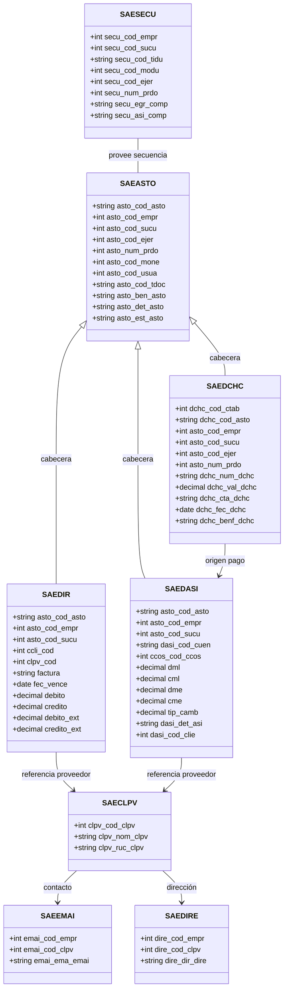
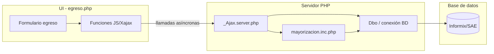

# README 2 – Diagramas UML y modelo de datos del Módulo de Egreso

## Visión general del modelo
El módulo se basa en entidades contables y de proveedores que se relacionan al registrar un egreso. Las clases/tablas clave provienen de las operaciones ejecutadas en `_Ajax.server.php` y `mayorizacion.inc.php`.

### Diagrama de clases (Mermaid)

### Justificación y fuentes
- `mayorizacion_class::secu_asto()` usa `saesecu` para leer/actualizar `secu_egr_comp` y `secu_asi_comp`, garantizando unicidad por empresa, sucursal, ejercicio y período.【F:mayorizacion.inc.php†L66-L107】
- `mayorizacion_class::saeasto()` inserta la cabecera del asiento (`saeasto`) con datos de empresa, moneda, beneficiario, tipo documental y usuario web.【F:mayorizacion.inc.php†L111-L147】
- Durante el guardado se recorren las líneas del grid para poblar `saedir` (documentos de proveedor) con factura, vencimiento y montos en ambas monedas.【F:_Ajax.server.php†L5900-L5950】
- Las líneas contables se registran en `saedasi` con cuenta contable, centro de costo, montos, cotización y banderas de banco/cheque cuando aplica.【F:_Ajax.server.php†L6078-L6172】
- Si la línea es bancaria se inserta un cheque en `saedchc` y se actualiza el correlativo en `saectab` con el número generado.【F:_Ajax.server.php†L6174-L6197】
- Los datos del proveedor (RUC, dirección, correo) se obtienen de `saeclpv`, `saedire` y `saeemai` para completar retenciones y beneficiarios.【F:_Ajax.server.php†L5924-L5944】

## Diagrama UML de componentes

### Interacción narrativa
1. **UI**: el usuario captura datos y desencadena funciones JS que envían peticiones Xajax al servidor (`_Ajax.server.php`).【F:egreso.php†L121-L210】
2. **Controlador**: el servidor valida el balance, obtiene secuenciales y delega en `mayorizacion.inc.php` para construir cabecera (`saeasto`) y detalle (`saedasi`).【F:_Ajax.server.php†L5751-L5839】【F:mayorizacion.inc.php†L111-L200】
3. **Persistencia**: mediante la clase `Dbo`, las operaciones SQL se ejecutan contra la base Informix/SAE en una transacción, incluyendo documentos (`saedir`) y cheques (`saedchc`).【F:_Ajax.server.php†L5900-L5950】【F:_Ajax.server.php†L6174-L6197】
4. **Respuesta**: Xajax retorna HTML/JS para refrescar grids y totales en la UI sin recarga de página.【F:_Ajax.server.php†L5731-L5744】

