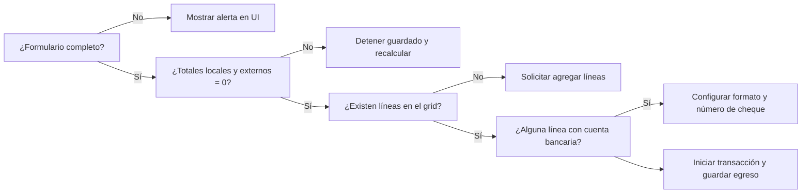

# README 3 – Diagramas de flujo, validaciones y casos de uso del proceso de pago

## Flujo end-to-end del pago a proveedores
```mermaid
flowchart TD
    A[Inicio egreso en UI] --> B[Captura de empresa/sucursal/proveedor]
    B --> C[Agrega facturas y retenciones al grid]
    C --> D[Ingresa líneas contables (cuentas, montos, centros costo)]
    D --> E[Validación de balance débitos/créditos]
    E -->|Balanceado| F[Solicita secuenciales SAESECU]
    E -->|No balanceado| X[Se bloquea guardado]
    F --> G[Actualiza adjuntos pendientes con asto]
    G --> H[Inserta cabecera SAEASTO]
    H --> I[Inserta detalle SAEDIR (facturas)]
    I --> J[Inserta detalle diario SAEDASI]
    J --> K{¿Línea bancaria?}
    K -->|Sí| L[Registra cheque SAEDCHC y actualiza SAECTAB]
    K -->|No| M[Continúa]
    L --> N[Commit]
    M --> N[Commit]
    N --> O[Respuesta Xajax actualiza UI]
```

### Explicación de cada etapa
- **Captura y grids**: la UI permite buscar proveedores, facturas y códigos de retención con modales/autocompletado. Las selecciones se almacenan en variables de sesión que el backend usa al guardar.【F:egreso.php†L121-L210】【F:_Ajax.server.php†L5751-L5799】
- **Validación de balance**: antes de procesar se suman débitos/créditos locales y extranjeros; si alguno no cuadra se detiene el guardado.【F:_Ajax.server.php†L5805-L5828】
- **Secuenciales**: se obtienen `secu_asto` y `secu_dia` según empresa/sucursal/tipo documental para garantizar unicidad del comprobante.【F:_Ajax.server.php†L5830-L5841】【F:mayorizacion.inc.php†L66-L107】
- **Adjuntos**: los documentos pendientes del proveedor se vinculan al asiento generado y se eliminan los pendientes.【F:_Ajax.server.php†L5844-L5858】
- **Cabecera y detalle**: `saeasto` registra el egreso, `saedir` relaciona facturas/retenciones, y `saedasi` almacena las líneas contables con centros de costo y actividad.【F:mayorizacion.inc.php†L111-L147】【F:_Ajax.server.php†L5900-L5950】【F:_Ajax.server.php†L6078-L6172】
- **Cheques**: cuando hay cuenta bancaria se inserta en `saedchc` y se actualiza el número de cheque en `saectab`.【F:_Ajax.server.php†L6174-L6197】
- **Respuesta**: tras el commit, Xajax retorna HTML para refrescar totales y grids sin recargar la página.【F:_Ajax.server.php†L5731-L5744】

### Validaciones críticas en tiempo de ejecución (Mermaid)


El diagrama agrupa las principales validaciones previas al guardado. Las condiciones de formulario y balance se aplican en cliente y servidor; la verificación de líneas/cheques se ejecuta en el backend mientras recorre los grids y determina si debe registrar `saedchc` y actualizar `saectab`.

## Validaciones y controles detallados
- **Duplicidad**: en la UI se evita guardar si ya existe un código de asiento o comprobante cargado en el formulario.【F:egreso.php†L151-L180】
- **Balance contable**: cálculo de `tot_loc` y `tot_ext` debe ser cero; de lo contrario no se ejecutan escrituras en BD.【F:_Ajax.server.php†L5805-L5828】
- **Datos de proveedor**: el backend extrae RUC, dirección y correo desde `saeclpv`, `saedire` y `saeemai` para completar retenciones y beneficiarios antes de registrar líneas.【F:_Ajax.server.php†L5924-L5944】
- **Cheques y cuentas bancarias**: si una línea contable trae cuenta bancaria, se marca como bancaria (`opBacn`), se determina formato de cheque y se actualiza `saectab` con el número usado.【F:_Ajax.server.php†L6078-L6172】【F:_Ajax.server.php†L6174-L6197】
- **Transaccionalidad**: todas las inserciones se realizan dentro de una transacción Informix (`BEGIN WORK`) para asegurar atomicidad.【F:_Ajax.server.php†L5829-L5836】

## Diagrama de casos de uso
```mermaid
usecaseDiagram
    actor Administrador
    actor Contador
    actor Operador as "Usuario operativo"
    actor SistemaExterno as "Sistema externo"

    usecase UC1 as "Registrar egreso"
    usecase UC2 as "Adjuntar/consultar documentos"
    usecase UC3 as "Emitir cheque"
    usecase UC4 as "Consultar facturas/retenciones"

    Operador --> UC1
    Operador --> UC2
    Operador --> UC4
    Contador --> UC1
    Contador --> UC3
    Administrador --> UC2
    SistemaExterno --> UC4
```

### Roles y responsabilidades
- **Usuario operativo**: captura datos del egreso, busca proveedores y dispara el guardado vía Xajax.【F:egreso.php†L121-L210】
- **Contador**: valida balances, configura cuentas/centros de costo y autoriza pagos, incluyendo la emisión de cheques que el sistema registra en `saedchc`.【F:_Ajax.server.php†L6078-L6172】【F:_Ajax.server.php†L6174-L6197】
- **Administrador**: gestiona documentos y adjuntos asociados al proveedor/egreso, aprovechando la actualización automática al generarse el asiento.【F:_Ajax.server.php†L5844-L5858】
- **Sistema externo**: consulta facturas/retenciones disponibles para aplicar a egresos (por ejemplo, integraciones de compras) a través de los mecanismos de búsqueda usados por la UI.【F:_Ajax.server.php†L5900-L5950】

Estos roles se cruzan con los módulos descritos en el diagrama de flujo: el Operador realiza la captura y solicita el guardado, el Contador revisa balance y cheques antes de aprobar, y el Administrador asegura que la documentación soporte el egreso que finalmente se consolida en la base Informix.

